<div align="center">
  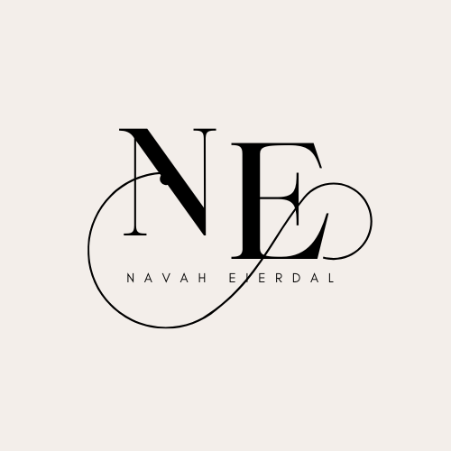
</div>

<div align= "center">

</div>

# Navah Eierdal's Portfolio Website

Visit the deployed site: [Navah Eierdal](https://navyblue06.github.io/milestone1nav/)

This is a personal portfolio website built to showcase my professional journey, skills, projects, and contact information. It aims to provide recruiters and collaborators with a clear and visually appealing overview of my capabilities and achievements.


---

## Table of Contents
1. [UX](#ux)
   - [Visitor Goals](#visitor-goals)
   - [Business Goals](#business-goals)
   - [User Stories](#user-stories)
2. [Features](#features)
   - [Page Elements](#page-elements)
   - [Interactive Features](#interactive-features)
3. [Technologies Used](#technologies-used)
4. [Visual Design](#visual-design)
   - [Wireframes](#wireframes)
   - [Fonts](#fonts)
   - [Icons](#icons)
   - [Colors](#colors)
   - [Images](#images)
   - [Styling](#styling)
5. [Testing](#testing)
   - [Methods](#methods)
   - [Bugs](#bugs)
6. [Deployment](#deployment)
7. [Credits and Contact](#credits-and-contact)

---

## UX

### Visitor Goals
- Explore my work and understand my skills and expertise.
- Easily navigate through the website and access relevant information.
- View detailed project descriptions and examples.

### Business Goals
- Present a polished and professional online presence.
- Showcase my unique blend of business and technical skills.
- Provide a seamless way for recruiters and collaborators to contact me.

### User Stories
1. **As a recruiter,** I want to see an overview of the candidate's projects and skills.
2. **As a potential collaborator,** I want to find contact information easily.
3. **As a visitor,** I want to navigate the website effortlessly and understand the candidate's strengths.

---

## Features

### Page Elements
1. **Home Page (index.html)**:
   - Introduction with a mission statement.
   - Carousel gallery highlighting photos and achievements.
   - Sidebar with quick facts and social links.

2. **Portfolio Page (portfolio.html)**:
   - Gallery-style project showcase.
   - Description of each project with a link to view more.

3. **Contact Page (contact.html)**:
   - Contact form with fields for name, email, and message.
   - "Thank You" page on successful submission.

4. **404 Page (404.html)**:
   - Creative placeholder page for non-existent links.
   - Includes an engaging video background.

5. **Thank You Page (thanku.html)**:
   - Acknowledges users for reaching out.
   - Video background for visual appeal.

### Interactive Features
- **Navigation Bar**:
  - Fixed and responsive for easy access to all sections. I chose to have a simple navbar to avoid confusion for the user. 
  <div align="center">
  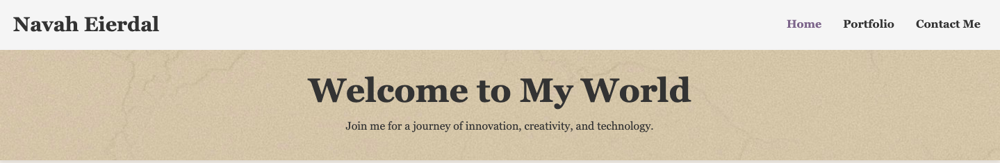
  </div>

- **Carousel**:
  - Interactive image slider for showcasing achievements.
  <div align="center">
  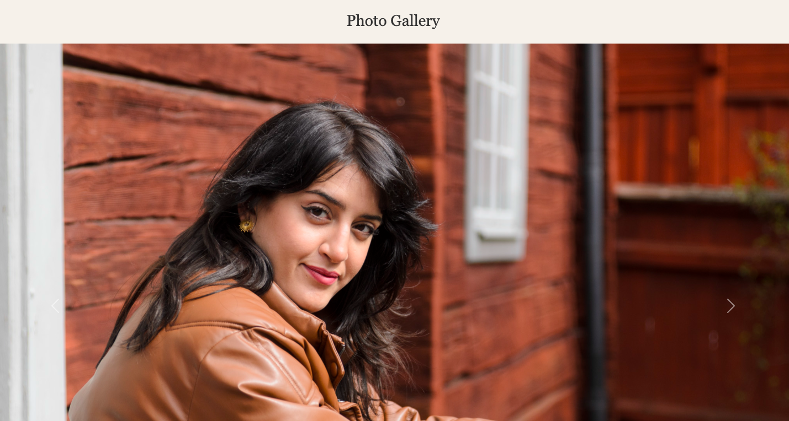
  </div>
  - The carousel contains 3 personal images with an automatic slide-show. 

- **Form Validation**:
  - Validates inputs in the contact form.

  <div align="center">
  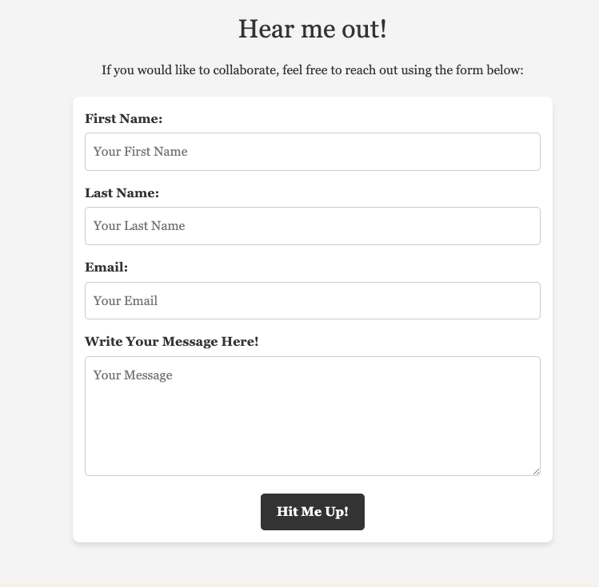
  </div>

---

## Technologies Used
- **Languages**: HTML, CSS
- **Frameworks**: Bootstrap 5.3.3
- **Icons**: Bootstrap Icons
- **Tools**: GitHub Pages for deployment, Gitpod for development

---

## Visual Design

### Wireframes
- The wireframes for this project were created using [balsamiq](https://www.balsamiq.com). They include desktop, tablet, and mobile versions of the website to ensure responsiveness.
- Screenshots of the wireframes: 

Desktop:

 Index
<div align="center">
  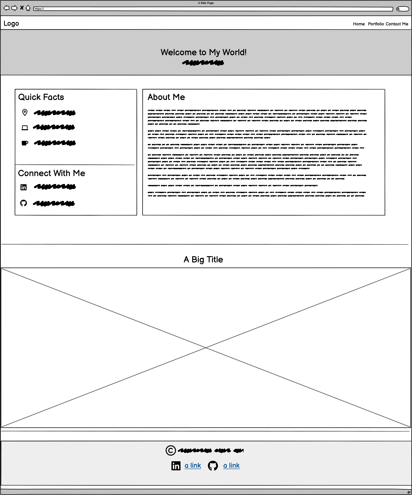
  </div>
 
  --
  Portfolio
  <div align="center">
  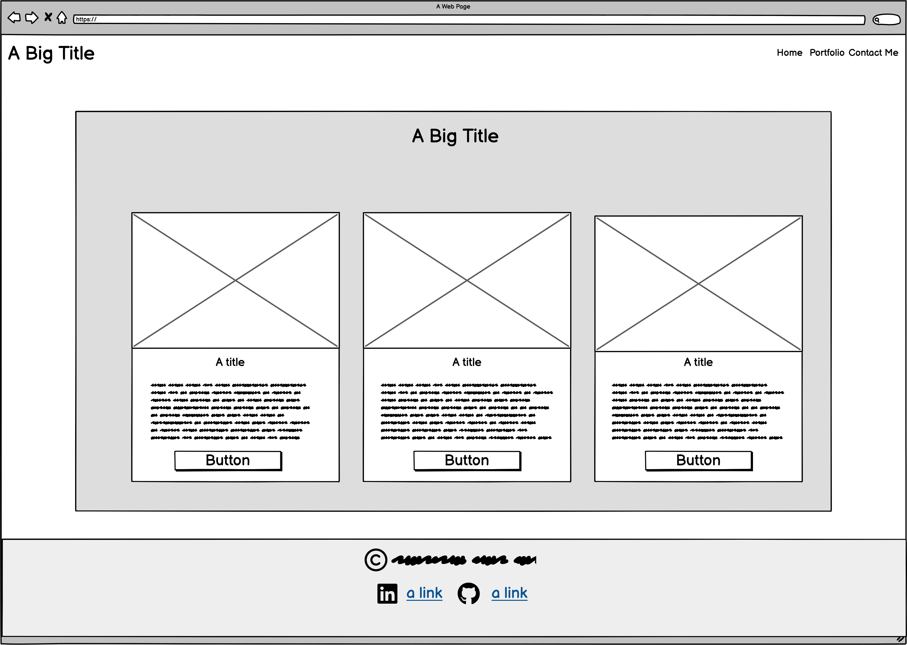
  </div>
  --
  Contact
  <div align="center">
  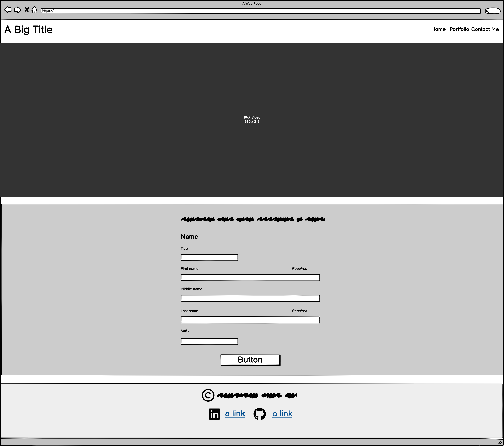
  </div>
--
Mobile device:
Index
<div align="center">
  
  </div> 
--
Portfolio
<div align="center">
  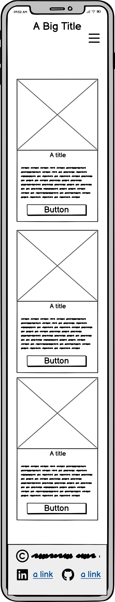
  </div>
--
Contact
<div align="center">
  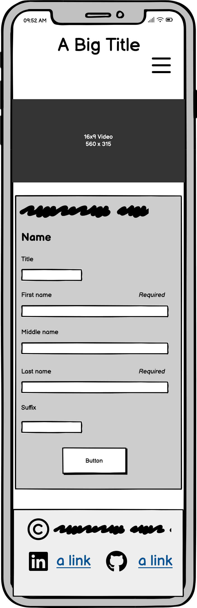
  </div>


### Fonts
- **Primary Font**: Georgia (serif) – for body text to ensure a professional and readable design.
- **Fallback Fonts**: System fonts to maintain consistency across platforms.
- The font choices aim to convey professionalism and a clean aesthetic.

### Icons
- Icons are implemented using **Bootstrap Icons**. They include for example:
  - LinkedIn Icon: `<i class="bi bi-linkedin"></i>`
  - GitHub Icon: `<i class="bi bi-github"></i>`
- The icons enhance navigation and visual clarity by highlighting key links.

### Colors
The following colors are used in the design of this project to create a cohesive, professional and visually appealing layout:


<div align="center"> 
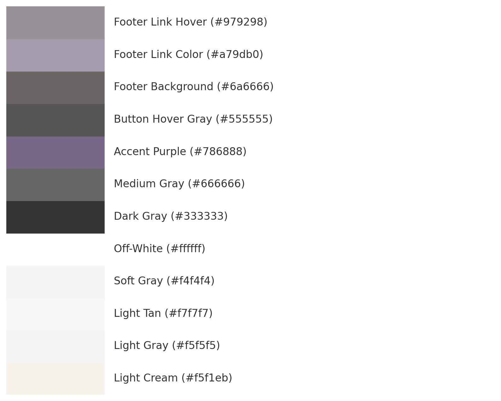
</div>

#### Primary Colors
- **Background Colors:**
  - Light Cream: `#f5f1eb` (General background)
  - Light Gray: `#f5f5f5` (Header and navigation backgrounds)
  - Light Tan: `#f7f7f7` (Hero section)
  - Soft Gray: `#f4f4f4` (Contact section)
  - Off-White: `#ffffff` (Form background)

- **Text Colors:**
  - Dark Gray: `#333` (Primary text)
  - Medium Gray: `#666` (Secondary text)
  - Accent Purple: `#786888` (Hovered or active links)

#### Accent Colors
- **Links and Icons:**
  - Primary Blue: `#333` (Default state for links)
  - Accent Purple: `#786888` (Hovered or active links)

- **Button Colors:**
  - Button Background: `#333` (Default state)
  - Button Hover: `#555` (Hover state)

#### Footer Colors
- Footer Background: `#6a6666` (Dark gray)
- Footer Link Color: `#a79db0` (Light purple-gray)
- Footer Link Hover: `#979298` (Slightly darker purple-gray)

### Images
- All images used are stored in the `assets/images/` directory.
- High-quality and royalty-free images were sourced from Pexels for the portfolio section.
- My own pictures are also included.
- Images are optimized for web use to ensure fast loading times.

### Styling
- Styling is primarily handled using **Bootstrap** for layout and responsiveness.
- Custom CSS (`assets/css/style.css`) is used for:
  - Unique header and footer designs.
  - Color scheme implementation.
  - Hover effects on links and buttons.
- Special attention was paid to accessibility, ensuring readable text contrast and intuitive interactions.

---

## Testing

### Methods
1. **Validation**:

  # Website Validation Summary

The HTML for the website have been validated using [W3C Validator](https://validator.w3.org/) and the CSS have been validated using [W3C CSS Validator](https://jigsaw.w3.org/css-validator/). Below are the validation results for each page:

| Page              | Status  | Validation Image                                  |
|-------------------|---------|--------------------------------------------------|
| [index.html](/index.html)             | Passed  | 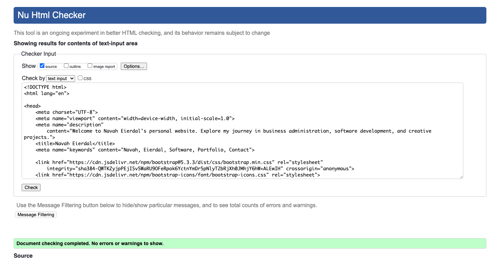    |
| [portfolio.html](/portfolio.html)     | Passed  | 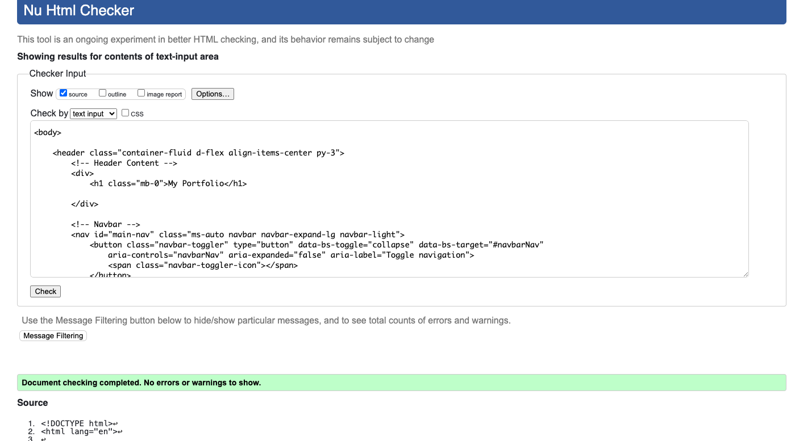    |
| [contact.html](/contact.html)         | Passed  | 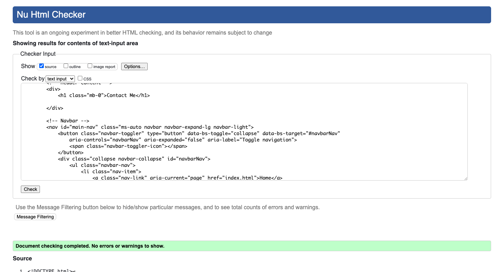  |
| [404.html](/404.html)                 | Passed  | 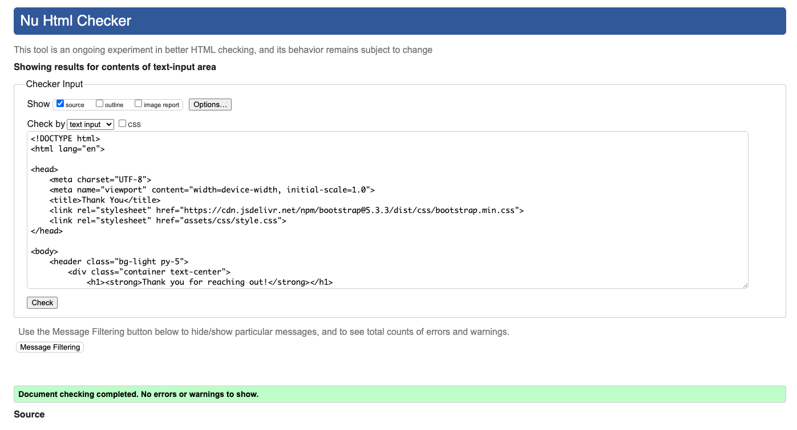      |
| [thanku.html](/thank-you.html)     | Passed  | 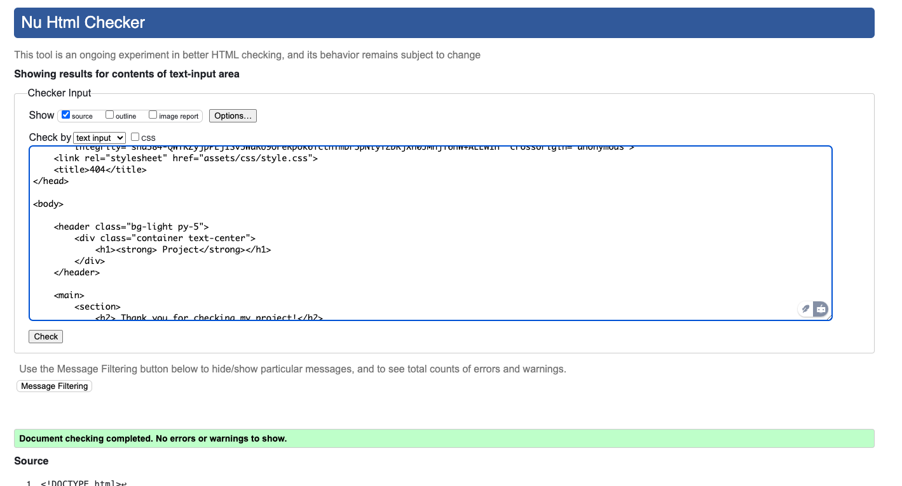       |
| [style.css](/style.css)               | Passed  | 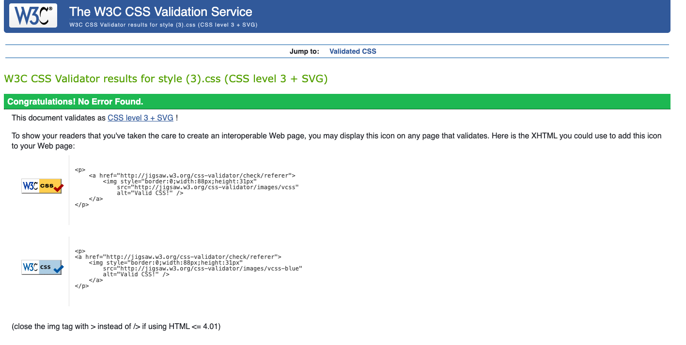      |

Each page was tested to ensure it complies with web standards, providing a robust and accessible user experience. 

---

2. **Cross-Browser Testing**:
   - Tested on Chrome, Edge, and Safari.
3. **Device Responsiveness**:
   - Verified on desktop, tablet, and mobile devices.

### Bugs
- **Fixed**:
  - Alignment issues in the navigation bar on mobile devices.
  
- **Known**:
  - None reported as of now.

---

## Deployment

### Local Deployment
1. Clone the repository:
   ```bash
   git clone https://github.com/username/portfolio-website.git
