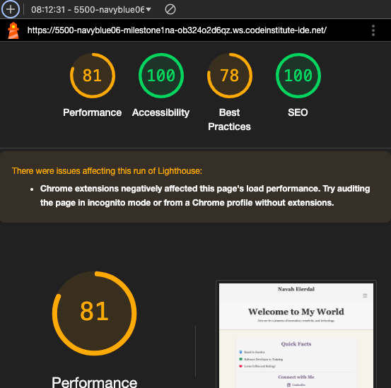
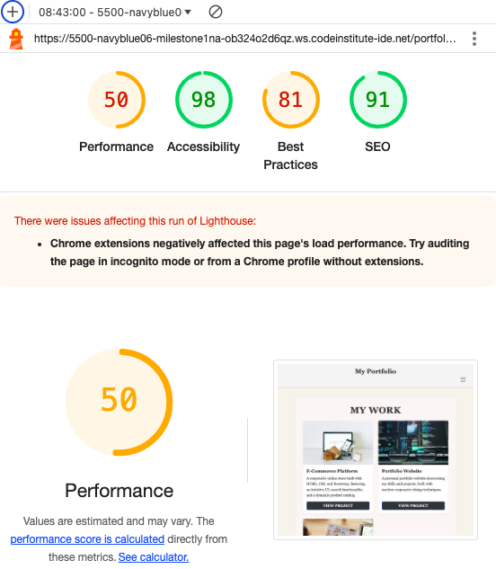
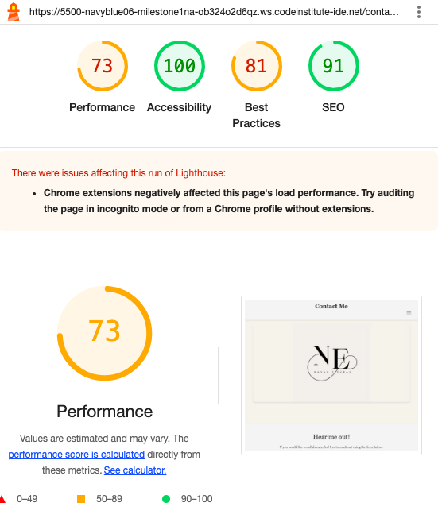

<div align="center">
  
</div>

<div align= "center">

</div>

# Navah Eierdal's Portfolio Website

Visit the deployed site: [Navah Eierdal](https://navyblue06.github.io/milestone1nav/)

This is a personal portfolio website built to showcase my professional journey, skills, projects, and contact information. It aims to provide recruiters and collaborators with a clear and visually appealing overview of my capabilities and achievements.


---

## Table of Contents
1. [UX](#ux)
   - [Visitor Goals](#visitor-goals)
   - [Business Goals](#business-goals)
   - [User Stories](#user-stories)
2. [Features](#features)
   - [Page Elements](#page-elements)
   - [Interactive Features](#interactive-features)
3. [Technologies Used](#technologies-used)
4. [Visual Design](#visual-design)
   - [Wireframes](#wireframes)
   - [Fonts](#fonts)
   - [Icons](#icons)
   - [Colors](#colors)
   - [Images](#images)
   - [Styling](#styling)
5. [Testing](#testing)
   - [Methods](#methods)
   - [Bugs](#bugs)
6. [Deployment](#deployment)
7. [Credits and Contact](#credits-and-contact)

---

## UX

### Visitor Goals
- Explore my work and understand my skills and expertise.
- Easily navigate through the website and access relevant information.
- View detailed project descriptions and examples.

### Business Goals
- Present a polished and professional online presence.
- Showcase my unique blend of business and technical skills.
- Provide a seamless way for recruiters and collaborators to contact me.

### User Stories
1. **As a recruiter,** I want to see an overview of the candidate's projects and skills.
2. **As a potential collaborator,** I want to find contact information easily.
3. **As a visitor,** I want to navigate the website effortlessly and understand the candidate's strengths.

---

## Features

### Page Elements
1. **Home Page (index.html)**:
   - Introduction with a mission statement.
   - Carousel gallery highlighting photos and achievements.
   - Sidebar with quick facts and social links.

2. **Portfolio Page (portfolio.html)**:
   - Gallery-style project showcase.
   - Description of each project with a link to view more.

3. **Contact Page (contact.html)**:
   - Contact form with fields for name, email, and message.
   - "Thank You" page on successful submission.

4. **404 Page (404.html)**:
   - Creative placeholder page for non-existent links.
   - Includes an engaging video background.

5. **Thank You Page (thanku.html)**:
   - Acknowledges users for reaching out.
   - Video background for visual appeal.

### Interactive Features
- **Navigation Bar**:
  - Fixed and responsive for easy access to all sections. I chose to have a simple navbar to avoid confusion for the user. 
  <div align="center">
  
  </div>

- **Carousel**:
  - Interactive image slider for showcasing achievements.
  <div align="center">
  
  </div>
  - The carousel contains 3 personal images with an automatic slide-show. 

- **Form Validation**:
  - Validates inputs in the contact form.

  <div align="center">
  
  </div>
- **Lighthouse**:
Scored 100 on different
---

## Technologies Used
- **Languages**: HTML, CSS
- **Frameworks**: Bootstrap 5.3.3
- **Icons**: Bootstrap Icons
- **Tools**: GitHub Pages for deployment, Gitpod for development

---

## Visual Design

### Wireframes
- The wireframes for this project were created using [balsamiq](https://www.balsamiq.com). They include desktop, tablet, and mobile versions of the website to ensure responsiveness.
- Screenshots of the wireframes: 

Desktop:

 Index
<div align="center">
  
  </div>
 
  --
  Portfolio
  <div align="center">
  
  </div>
  --
  Contact
  <div align="center">
  
  </div>
--
Mobile device:
Index
<div align="center">
  
  </div> 
--
Portfolio
<div align="center">
  
  </div>
--
Contact
<div align="center">
  
  </div>


## Footer

<div align="center">
  
  </div>

- Positioned at the bottom of each page, focusing on providing contact information and linking to social media platforms.
- Consists of a centered layout, styled for simplicity and elegance.
- Includes two main sections:
  - A copyright notice with the current year and your name.
  - Social media links with icons for LinkedIn and GitHub.
- The design is fully responsive, ensuring the footer looks consistent across devices.
- Styled with Bootstrap classes for a clean and professional appearance.


### Fonts
- **Primary Font**: Georgia (serif) – for body text to ensure a professional and readable design.
- **Fallback Fonts**: System fonts to maintain consistency across platforms.
- The font choices aim to convey professionalism and a clean aesthetic.

### Icons
- Icons are implemented using **Bootstrap Icons**. They include for example:
  - LinkedIn Icon: `<i class="bi bi-linkedin"></i>`
  - GitHub Icon: `<i class="bi bi-github"></i>`
- The icons enhance navigation and visual clarity by highlighting key links.

### Colors
The following colors are used in the design of this project to create a cohesive, professional and visually appealing layout:


<div align="center"> 

</div>

#### Primary Colors
- **Background Colors:**
  - Light Cream: `#f5f1eb` (General background)
  - Light Gray: `#f5f5f5` (Header and navigation backgrounds)
  - Light Tan: `#f7f7f7` (Hero section)
  - Soft Gray: `#f4f4f4` (Contact section)
  - Off-White: `#ffffff` (Form background)

- **Text Colors:**
  - Dark Gray: `#333` (Primary text)
  - Medium Gray: `#666` (Secondary text)
  - Accent Purple: `#786888` (Hovered or active links)

#### Accent Colors
- **Links and Icons:**
  - Primary Blue: `#333` (Default state for links)
  - Accent Purple: `#786888` (Hovered or active links)

- **Button Colors:**
  - Button Background: `#333` (Default state)
  - Button Hover: `#555` (Hover state)

#### Footer Colors
- Footer Background: `#6a6666` (Dark gray)
- Footer Link Color: `#a79db0` (Light purple-gray)
- Footer Link Hover: `#979298` (Slightly darker purple-gray)

### Images
- All images used are stored in the `assets/images/` directory.
- High-quality and royalty-free images were sourced from Pexels for the portfolio section.
- My own pictures are also included.
- Images are optimized for web use to ensure fast loading times.

### Styling
- Styling is primarily handled using **Bootstrap** for layout and responsiveness.
- Custom CSS (`assets/css/style.css`) is used for:
  - Unique header and footer designs.
  - Color scheme implementation.
  - Hover effects on links and buttons.
- Special attention was paid to accessibility, ensuring readable text contrast and intuitive interactions.

---

## Testing

### Methods
1. **Validation**:

  # Website Validation Summary

The HTML for the website have been validated using [W3C Validator](https://validator.w3.org/) and the CSS have been validated using [W3C CSS Validator](https://jigsaw.w3.org/css-validator/). Below are the validation results for each page:

| Page              | Status  | Validation Image                                  |
|-------------------|---------|--------------------------------------------------|
| [index.html](/index.html)             | Passed  |     |
| [portfolio.html](/portfolio.html)     | Passed  |     |
| [contact.html](/contact.html)         | Passed  |   |
| [404.html](/404.html)                 | Passed  |       |
| [thanku.html](/thank-you.html)     | Passed  |        |
| [style.css](/style.css)               | Passed  |       |

Each page was tested to ensure it complies with web standards, providing a robust and accessible user experience. 

---

2. **Cross-Browser Testing**:
   - Tested on Chrome, Edge, and Safari.
3. **Device Responsiveness**:
   - Verified on desktop, tablet, and mobile devices.
   - verified on iphone 16, Samsung Galaxy Z flip 6, Ipad, and desktop macBook air. 

## Lighthouse Testing Results

Below are the Lighthouse testing results for the three different pages of the website:

---

### Home Page


The **Home Page** of the website achieved the following scores:
- **Performance**: 81
- **Accessibility**: 100
- **Best Practices**: 78
- **SEO**: 100

The page excelled in accessibility and SEO but showed room for improvement in performance and best practices. A note indicates that Chrome extensions may have impacted the load performance. The page, titled "Navah Eierdal - Welcome to My World," introduces the site with quick facts and navigation links.

---

### Portfolio Page


The **Portfolio Page** scored:
- **Performance**: 50
- **Accessibility**: 98
- **Best Practices**: 81
- **SEO**: 91

This page had a lower performance score compared to others, but accessibility, SEO, and best practices performed well. Chrome extensions may have affected the performance. The page highlights projects under "My Work," featuring items such as an E-Commerce Platform and a Portfolio Website.

---

### Contact Page


The **Contact Page** achieved the following scores:
- **Performance**: 73
- **Accessibility**: 100
- **Best Practices**: 81
- **SEO**: 91

The contact page had perfect accessibility, with moderate performance and minor improvements needed for SEO and best practices. The page includes a simple and elegant design titled "Contact Me," with the initials "NE" and a prompt to connect.

---

> **Note**: All results mention that Chrome extensions might have affected load performance. Running the audit in incognito mode or with extensions disabled is recommended for more accurate results.


### Bugs
- **Fixed**:
  - Alignment issues in the navigation bar on mobile devices.
  
- **Known**:
  - None reported as of now.

---


# Deployment

## Local Deployment

### Local Preparation

**Requirements:**
- An IDE of your choice, such as [Visual Studio Code](https://code.visualstudio.com/) or [Atom](https://atom.io/)
- [Git](https://git-scm.com/)
- A web browser for testing the project
- Basic knowledge of HTML, CSS, and JavaScript

### Local Instructions

1. Download the project repository [here](https://github.com/NavyBlue06/milestone1nav/archive/main.zip) and extract the zip file to your desired location. Alternatively, clone the repository using:
   ```
   git clone https://github.com/NavyBlue06/milestone1nav.git
   ```
2. Launch your IDE and open the base directory of the extracted or cloned repository.
3. To view the project locally, open the `index.html` file in a web browser. Alternatively, if Python is installed, you can serve the project locally by running:
   ```
   python3 -m http.server
   ```
   Then, visit `http://localhost:8000` in your browser.
4. Modify the files as needed to customize or enhance the project.

---

## GitHub Deployment

### GitHub Preparation

**Requirements:**
- A free GitHub account

### GitHub Instructions

1. Sign in to your GitHub account and go to your repository: [https://github.com/NavyBlue06/milestone1nav](https://github.com/NavyBlue06/milestone1nav).
2. Ensure all updates are committed and pushed to the main branch.
3. Open the **Settings** page of the repository.
4. Scroll down to the **Pages** section under "Code and automation."
5. Under "Source," choose the branch to deploy (e.g., `main`) and select the `/root` folder.
6. Click **Save** and allow a few moments for GitHub Pages to publish the site.
7. Once completed, the site will be accessible at: `https://navyblue06.github.io/milestone1nav/`.

---
## Credits and Contact

### Content
Nearly all text content for this project was generated or refined using OpenAI's ChatGPT-4, partially enhancing the performance of the webpage in Lighthouse testing. The AI was also instrumental in correcting and generating high-quality textual content to ensure clarity and professionalism.

Any external code utilized from online sources is documented and credited within the code itself.

All other media used is my own.

### Contact
If you have any questions or feedback, feel free to contact me at `navaheierdal92@outlook.com`.


